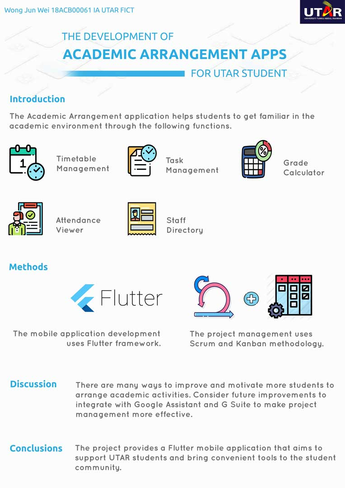

# Potaru_Collection
Use Dart, NodeJS (REST API), Python and flutter framework to create mobile applications to help students arrange their time in university life

## Flutter Version
>SDK 1.12.13+hotfix.9  
>Dart 2.7.2  

## Showcase

## Poster

